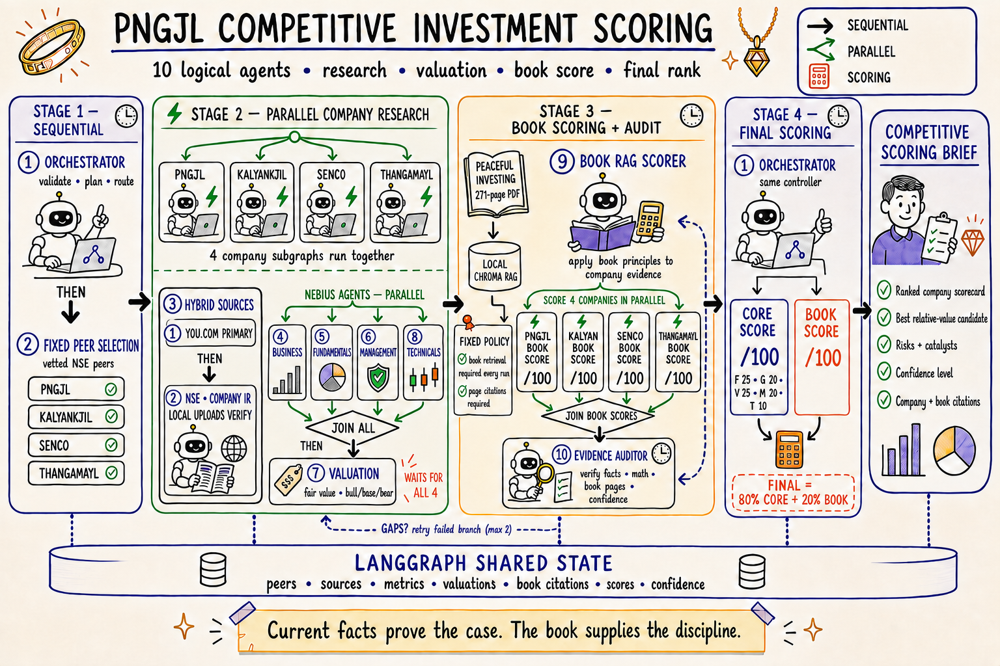

# PNGJL Competitive Investment Scoring

New to the project? Start with the [illustrated beginner code guide](docs/index.html)
or its [Markdown version](docs/CODE_GUIDE.md). The
[5 September live refresh review](docs/live-refresh-review-2026-09-05.md) records
the measured performance, trace checks, fixes, and remaining limitations.

For agent evaluations, see the [44-case remaining-agent baseline](evals/agents/findings.md)
and its [expected/predicted table](evals/agents/expected_vs_predicted.csv). These are
synthetic development checks; live-search and private-book retrieval quality are
outside that baseline's scope. Fundamentals retains its [separate evaluation suite](evals/README.md).

A beginner-readable LangGraph project that compares **P N Gadgil Jewellers Limited
(NSE: PNGJL)** with three listed jewellery peers, adds a 2–3 year investment
research angle, and applies a private, page-cited framework from *Peaceful
Investing*.

> This is an educational research system—not personal financial advice. Demo
> values are invented. Live values are time-sensitive and must be checked against
> primary filings before any investment decision.



## What is implemented

There are ten logical agents:

1. Orchestrator
2. Fixed Peer Selection
3. Hybrid Source Research (You.com first, then verification sources)
4. Business Analyst
5. Fundamentals + Growth Analyst
6. Management Analyst
7. Valuation Analyst
8. Technical Analyst (SMA20, SMA50, Wilder RSI14)
9. Peaceful Investing Book RAG Scorer
10. Evidence Auditor

The exact execution order is:

```text
SEQUENTIAL: Orchestrator → fixed, vetted NSE peer selection

PARALLEL across PNGJL + three peers:
  Sources first
    → Business ┐
    → Fundamentals ├─ JOIN ALL → Valuation
    → Management   │
    → Technicals ┘

SEQUENTIAL BARRIER: wait for all four company valuations

PARALLEL: four private-book RAG scores
  → JOIN ALL → Evidence audit → optional targeted retry (maximum 2)

SEQUENTIAL: deterministic final score → ranked briefing
```

The current peer universe is intentionally fixed to **KALYANKJIL, SENCO, and
THANGAMAYL**. That makes comparisons reproducible and prevents an untrusted web
page or model guess from changing the candidate set. Valuation waits for
**Business, Fundamentals, Management, and Technicals**. The
four-input join is visible in `build_company_subgraph()` in
`src/competitive_scoring/graph.py`.

## Scoring

The arithmetic is code, not an LLM opinion:

```text
Core = Fundamentals 25% + Growth 20% + Valuation 25%
     + Management 20% + Technicals 10%

Final = Core 80% + Peaceful Investing Book Alignment 20%
```

The Book Alignment Score has six fixed categories: financial strength (20),
earnings/cash quality (20), moat and self-funded growth (20), management and
capital allocation (20), valuation/margin of safety (15), and credit/downside
resilience (5). Every category needs both:

- a resolved book chunk with printed and PDF page numbers; and
- current company evidence from a dated external source.

If covered weight is below 80%, the book total is `null`, not an invented neutral
score. The book provides methodology; it never proves a current company fact.

Missing evidence is never converted into an average score. If any required
Fundamentals/Growth/Valuation/Management/Technicals component is unsupported,
that company remains in the briefing as **Not scored** and receives no rank. If
the evidence audit itself fails, all final scores are suppressed and the report
contains diagnostics instead of declaring a winner.

## Why the book uses local RAG—not memory or Pinecone

This is one private 271-page book. A local persistent Chroma index is simpler,
cheaper, and more private than a hosted vector database. The implementation uses
a deterministic local hashing embedder, so it downloads no embedding model and
needs no embedding API key. The PDF and derived index live under ignored paths.

The book is **not copied into this repository**. On this computer the app can find
the attached licensed copy at:

```text
~/Documents/DrVijay/Ebook-Peaceful-Investing.pdf
```

For another computer, put a licensed copy in `data/private/` or set
`BOOK_PDF_PATH`. Do not upload the PDF or `data/private/` to GitHub.

## Quick start

Python 3.11+ is required. These commands use the Python 3.12 installation found
on the current machine:

```bash
/opt/anaconda3/bin/python3 -m venv .venv
.venv/bin/python -m pip install --upgrade pip
.venv/bin/python -m pip install -e ".[dev]"
cp .env.example .env
```

Build the private book index once:

```bash
.venv/bin/competitive-scoring ingest-book
```

Run the deterministic offline demo:

```bash
.venv/bin/competitive-scoring run --mode demo
```

Open the interface:

```bash
.venv/bin/streamlit run streamlit_app.py
```

The CLI writes `outputs/briefing.md` and `outputs/briefing.json`. Streamlit also
offers both as download buttons.

### Report-first Streamlit behavior

Streamlit stores complete report snapshots under `outputs/report_store/<mode>/`.
When the page opens it loads the latest saved report immediately; it does not
spend You.com or LLM tokens merely because the browser was refreshed. Clicking
**Run all agents** starts one background job and keeps the previous report on
screen with real workflow progress and an approximate ETA. An audit-passed run
atomically replaces `latest.json`; an audit-failed attempt remains available for
diagnosis but cannot replace a previously validated ranking.

### Local filing cache

Public company PDFs and their extracted excerpts are cached in
`outputs/document_cache/`. Every run still fetches current IR/report catalogues
and checks each selected PDF with its origin. ETag/Last-Modified validators allow
an unchanged PDF to return HTTP 304 without transferring the file again. Without
validators, the PDF is downloaded again; identical bytes can still reuse their
extracted excerpt. Failed freshness checks never fall back to stale evidence.
Responses marked `Cache-Control: no-store` are not added to this cache.

The extractor scans all pages in plain mode, then extracts layout only for the
selected evidence pages (at most four). This preserves the existing financial
table formatting and page citations. Cached text is invalidated by changes in
PDF content, pypdf version, extraction policy, or excerpt/page limits. Damaged or
unwritable cache entries fall back to normal retrieval/extraction and produce
diagnostic events. Failure to extract a selected page's layout is reported as a
source failure and is never cached. Private uploads and the local book index are
separate.

Set `COMPETITIVE_SCORING_DOCUMENT_CACHE_DIR` to choose a different local directory,
or `off` to disable caching. The cache contains public PDF bytes and evidence text,
so keep it out of version control (the default `outputs/` is already ignored).
There is no automatic eviction; remove the cache directory while runs are stopped
to reclaim space. The next run recreates it. Run event logs expose `document.cache`
download/revalidation events, `pdf.cache` hits/misses, and separate
`pdf.scan_pages` / `pdf.layout_selected` timings.

## Live mode

Live mode uses a hybrid research policy. **You.com is the first and primary
search/news source**: it finds current company pages, announcements, coverage,
and possible evidence for every company. The pipeline then checks and fills the
results with higher-authority or user-supplied material:

1. You.com Search API performs the primary current web and news search.
2. NSE pages and official company investor-relations pages verify important
   claims and fill gaps. An official filing wins when sources disagree.
3. User-uploaded annual reports, results, presentations, and Screener exports
   provide additional evidence when a site is incomplete or blocks access.
4. Yahoo chart data is used only to calculate SMA20, SMA50, and Wilder RSI(14)
   locally.

The direct collector reads Screener through uploads; it does not log in to or
scrape screener.in. It adds Economic Times and Moneycontrol as manual reference
links rather than directly fetching those pages. Separately, You.com may return
snippets from these domains, and those search results can enter scoring evidence.

Add both your You.com and Nebius settings to `.env`:

```dotenv
APP_MODE=live
YDC_API_KEY=your_you_com_api_key

LLM_PROVIDER=nebius
NEBIUS_API_KEY=your_token_factory_key
NEBIUS_MODEL=moonshotai/Kimi-K3
NEBIUS_BASE_URL=https://api.tokenfactory.nebius.com/v1/
NEBIUS_API_STYLE=chat_completions
NEBIUS_REASONING_EFFORT=low
NEBIUS_MAX_TOKENS=16384
LLM_MAX_CONCURRENT_REQUESTS=4
LLM_MAX_ATTEMPTS=3
LLM_REQUEST_TIMEOUT_SECONDS=300
```

The configured Kimi K3 model uses Nebius Chat Completions. Its completion budget
includes internal reasoning, so the app uses low reasoning effort and a larger
token budget. Endpoint support differs by Nebius model; do not change the model
without also checking its supported endpoint.

Do not paste a real key into source code, a screenshot, GitHub, or chat. The
`.env` file is ignored by Git. If you prefer OpenAI, set `LLM_PROVIDER=openai`
and fill `OPENAI_API_KEY` / `OPENAI_MODEL` instead.

Then run:

```bash
.venv/bin/competitive-scoring run --mode live
```

Live mode does **not** silently fall back to demo data. If the LLM settings or
required evidence are missing, the workflow stops or marks a company unrankable.

### What you need to supply

The first three items are required to start live mode:

1. A You.com Search API key, stored locally as `YDC_API_KEY` in `.env`.
2. A Nebius Token Factory API key, stored locally as `NEBIUS_API_KEY` in `.env`.
3. A Nebius model/endpoint pair that supports strict structured JSON. This project
   is configured for `moonshotai/Kimi-K3` plus `chat_completions`.
4. Recommended: one Screener CSV/XLSX export for each of PNGJL, KALYANKJIL,
   SENCO, and THANGAMAYL. Upload these in the Streamlit sidebar.
5. Recommended: the latest official annual report, quarterly results, and
   investor presentation for each company. These are especially useful if a
   company site rejects automated requests.

Uploaded evidence is kept under `data/private/` and excluded from Git. In live
mode, You.com snippets and extracted evidence excerpts are sent to your
configured LLM for structured analysis. The *Peaceful Investing* book follows a
different boundary: its text stays inside the local RAG scorer and is not sent
to the LLM.

`RESEARCH_AS_OF` can pin a historical run. If it is blank, demo mode uses its
frozen sample date while live mode uses the current date. Search freshness,
publication dates, market-price requests, and metric dates are checked against
that cutoff to prevent accidental look-ahead.

- You.com search runs first. Direct automatic follow-up requests are restricted
  to a fixed exchange/company hostname allowlist, follow only validated HTTPS
  redirects, and have response-size caps.
- Nebius Kimi K3 is called through its OpenAI-compatible Chat Completions endpoint
  and receives a strict JSON schema for each analysis block. Calls use bounded
  repair attempts with precise validation feedback; final score arithmetic
  remains deterministic Python.
- A blocked source becomes a visible warning. Successful official/local sources
  are retained, but unsupported facts are never replaced with demo values.
- Daily prices are requested only through the research date, prefer adjusted
  close, retain the exact request URL, and are used locally for SMA20/SMA50 and
  Wilder RSI(14).

Relevant documentation: [You.com Search API](https://you.com/docs/api-reference/search/v1-search),
[Nebius Token Factory API](https://docs.tokenfactory.nebius.com/api-reference/introduction),
[NSE RSS and corporate information](https://www.nseindia.com/static/rss-feed),
[LangGraph graph API](https://docs.langchain.com/oss/python/langgraph/graph-api), and
[OpenAI Responses API](https://developers.openai.com/api/reference/cli/resources/responses/methods/create).

The conservative manual-only choices are intentional. Read the current
[Economic Times terms](https://economictimes.indiatimes.com/terms-conditions),
[Moneycontrol terms](https://www.moneycontrol.com/cdata/termsofuse.php), and
[Screener terms](https://www.screener.in/guides/terms/) before distributing or
commercializing an application that uses their content.

## Project map

```text
streamlit_app.py                    visual interface
src/competitive_scoring/
  graph.py                          sequential/parallel LangGraph orchestration
  agents.py                         the ten agent behaviors
  models.py                         validated data passed between agents
  scoring.py                        fixed Core and Final formulas
  rag.py                            private local PDF → Chroma index → retrieval
  book_policy.py                    six-category page-cited book policy
  llm.py                            Nebius/OpenAI-compatible structured extraction
  progress.py                       provider-neutral graph progress events
  report.py                         Markdown briefing renderer
  report_store.py                   atomic latest/history report persistence
  run_manager.py                    single-flight background refresh controller
  demo_data.py                      explicitly illustrative offline fixture
  uploads.py                        safe private Streamlit upload handling
  tools/you_search.py               primary You.com Search API adapter
  tools/free_sources.py             NSE/IR/upload verification and gap-fill collector
  tools/market_data.py              SMA20/SMA50/RSI14 calculations
tests/                              offline unit and graph tests
```

## Beginner tour

Start in `streamlit_app.py`. Its **Run all agents** button asks `RunManager` to
start one background refresh while the saved report remains visible. Next read
`graph.py`: edges show what is sequential and what is parallel, and progress
events explain which real node just finished. Open `agents.py` to see the work
performed by each node. Finally inspect `scoring.py` and `book_policy.py`; that is
where the reproducible formulas and guardrails live.

The code contains comments around decisions and boundaries—not comments that
merely repeat the next line—so a novice can follow why each step exists.
# CompetitiveAnalysis

## Run timings and diagnostic logs

Every research run now writes local diagnostics automatically, including failed
preflight checks and runs that do not produce a publishable report. In Streamlit,
open **Run timings and logs** to inspect the latest ten runs for the selected mode,
compare operation timings, inspect failed attempts, and download the logs. This
panel is independent of the last validated report. The CLI and live-refresh
script print the diagnostic directory even when a run fails.

```text
outputs/run_logs/<demo-or-live>/<run-id>/
  events.jsonl    append-only, flushed start/end events and diagnostics
  summary.json   wall time, operation totals, slowest calls, failures, token usage
```

`COMPETITIVE_SCORING_RUN_LOG_DIR` optionally changes the log directory; relative
paths resolve against the project root. Logs remain local and the default
`outputs/` location is already ignored by Git. No external tracing service or
additional API key is required.

Each event includes a run ID, UTC timestamp, monotonic elapsed time, and, for
operations, a span ID and parent span ID. Company labels stay attached through
parallel LangGraph workers. Saved report metadata includes the same run ID.
Timings cover source queries and retry backoff, individual HTTP requests, PDF
scanning/extraction, local uploads, model slot wait time, provider time and each
model attempt, book indexing/retrieval, evidence audit, publication checks, and
report saving/export. Model request/response metadata includes the actual token
budget, schema name, prompt character count, finish status and token usage when
the SDK provides them. Missing usage stays unknown, not zero. Failed calls that
later recover remain visible in diagnostics and do not add evidence-audit warnings.

To locate a bottleneck, first compare `search.query`, `sources.http`,
`pdf.scan_pages`, `llm.queue_wait`, and `llm.provider`. A long queue wait means
requests are waiting for the shared concurrency gate; a long provider span means
the SDK is waiting for or processing the response. Inspect parent span IDs to
connect a provider call to its company, extraction step and attempt. Durations
include child operations and overlap between parallel branches, so their totals
must not be added together as overall run wall time.

The event log is flushed as work happens; the summary is updated periodically
and around potentially slow calls, then finalized when the run exits. If the
process is killed, its last summary may still say `running`; the unpaired start
events identify unfinished work. Completed statuses distinguish `succeeded`,
`unvalidated` and `failed`; calling `run_research()` directly records `completed`
when the graph finishes successfully, because publication belongs to its caller.

Logs exclude prompts, document/book text, model answers, raw exception messages,
credentials, full URLs, and uploaded filenames. HTTP hosts and opaque resource
hashes identify fetches without retaining query strings or document names.
Validation failures retain error types and known schema field names; library
PDF warnings retain their source and count, not potentially private warning text.
Logging I/O failures are reported without aborting the research itself. Old run
logs are retained until you remove them; changing the log directory does not move
existing history.
# AIEvals
