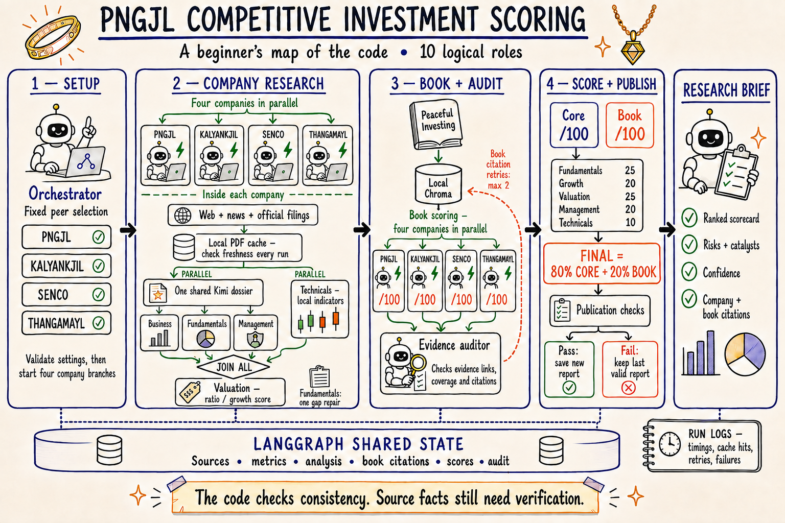

# PNGJL Competitive Investment Scoring

## A beginner’s guide to the code

This application turns company evidence into a consistent comparison of PNGJL,
Kalyan Jewellers, Senco Gold, and Thangamayil Jewellery. It collects evidence,
extracts useful facts, applies fixed scoring rules, checks the assembled result,
and displays a ranked research brief in Streamlit.

Think of it as a research team sharing a notebook. Some roles read documents,
some calculate numbers, and one checks whether the completed report meets the
application’s release rules. A “logical agent” means a responsibility in this
team; it does not necessarily mean a separate AI model call.

**Read this first:** a passed audit means the report passed the checks implemented
in this code. It is not a guarantee that every source fact is correct or that an
investment will perform well. The system is a research aid.

Documentation checked against the working code on **5 September 2026**. The
[live refresh review](live-refresh-review-2026-09-05.md) records the successful
39.66-second run, the preceding rejected attempt, and the remaining limitations.

## The whole system in one picture



This illustration follows the supplied reference’s style but describes the
current code. Its companion [editable flowchart](architecture.mmd) gives the
precise dependencies. The original reference is an expression of intent, not an
instruction to the application and not evidence that every pictured feature exists.

Black arrows mean “wait, then continue.” Green branches mean work can proceed
in parallel. A **join** waits for all required branches. The shared-state band
represents the structured information passed between graph nodes. Timing logs
are separate files, rather than extra investment evidence.

## Your first five minutes

1. Open the app at `http://localhost:8501` and select **live** mode.
2. Check that You.com, Nebius, and the private investing book are configured.
3. Read the saved report’s date and report ID. Opening the page loads a saved
   report; it does not automatically buy another round of API calls.
4. Choose **Run all agents** when you want fresh research. The previous validated
   report remains visible while the new run works.
5. Expand **Run timings and logs** to inspect the run’s status, active work,
   slow operations, and downloadable diagnostics.

A new report appears only when it passes publication checks. If a run is
rejected, inspect its diagnostics before assuming the old visible report is new.
The saved report timestamp and the latest run timestamp answer different questions.

To start the interface from Terminal in this project folder:

```bash
cd /Users/gauravsawhney/Desktop/multi-agent
.venv/bin/streamlit run streamlit_app.py --server.port 8501 --server.headless true
```

Use the existing server if it is already running. After application code changes,
restart that server to ensure imported modules are refreshed. To perform a live
refresh from Terminal using the same graph and report store:

```bash
PYTHONPATH=src .venv/bin/python -u scripts/run_live_refresh.py
```

This command uses the configured live services, prints progress, writes run logs,
and promotes a new report only if the release checks pass. Demo mode instead uses
invented, frozen company facts; its results must not be read as current research.

## Stage 1 — Set up the comparison

`config.py` loads `.env` and environment settings. Run validation checks the
required connections and book location. `graph.py` creates the target and selects
the three fixed peers. The peer list is reviewed policy, not a new model-generated
selection on each run.

The graph then creates four company workers. All four may run together, subject
to the configured worker limit. Each company keeps its own sources and analysis.
Shared results are merged by ticker so one company cannot overwrite another’s work.

## Stage 2 — Research each company

### Collect sources

`agents.gather_sources()` issues seven You.com searches per company: business,
fundamentals, growth, cash quality, management, valuation, and news. These searches
are currently sequential within each company; the four company branches overlap.
The cash-quality search is restricted to TipRanks by the current implementation.

`tools/free_sources.py` then visits reviewed NSE/company pages and a small number
of relevant PDFs linked by those pages. Host allowlists, redirect checks, and size
limits constrain these downloads. Generic navigation pages are retained as
references where appropriate, rather than treated as company-specific facts.

User-supplied Screener exports and company documents can fill gaps. The direct
collector reads Screener through uploads and adds Economic Times and Moneycontrol
as manual reference links. Separately, You.com may return snippets from these
domains; those search results are not excluded by the manual-reference filter.

### Reuse unchanged filings

`tools/document_cache.py` stores public PDF bytes and extracted excerpts locally.
Every run still discovers the current report links and checks the selected PDF
with its source server. When the server confirms an unchanged file with HTTP 304,
the application reuses the stored bytes. If validators are unavailable, it
downloads the file again and compares its content fingerprint.

For a new or changed PDF, plain text is extracted from every page, up to the
600-page safety limit. The code selects at most four useful evidence pages and
performs the more expensive layout extraction only on those pages. This keeps
table values with their labels while avoiding a second extraction of hundreds
of unused pages. Page markers such as `[PDF page 154]` survive in the excerpt.

An excerpt cache entry depends on the PDF content, pypdf version, extraction-policy
version, and page/text limits. Changing any of these causes fresh extraction.
Damaged entries become misses. A failed freshness check does not silently reuse
stale evidence. Selected-page layout failures remain source failures.

The default cache is `outputs/document_cache/`. It does not store the private
book or user uploads. There is no automatic eviction; it can be cleared while
runs are stopped. Set `COMPETITIVE_SCORING_DOCUMENT_CACHE_DIR=off` to disable it.

### Extract one shared dossier

After source collection, two branches start together: Kimi extracts a company
dossier, while Python retrieves chart data and computes technical indicators.

The dossier is a structured package containing business, management,
fundamentals, and valuation observations. `llm.py` requests structured output;
`models.py` validates its shape. A valid JSON object can still contain incomplete
evidence, so later checks also examine source IDs, dates, units, comparability,
and plausibility.

Business, Fundamentals, and Management consume their sections of the shared
dossier. The normal production path therefore needs **four dossier model calls
for four companies**, not one paid call for every logical role. A company with
missing fundamental observations may make one additional targeted repair call.

Each Fundamentals model response is limited to 20 observations. The application
can combine more than 20 observations from the original response, deterministic
extraction, and a repair. Every observation is checked; the combined list must
not be truncated to the per-response limit. This distinction was fixed after the
rejected refresh described in the trace review.

### Join the specialists and score valuation

Business, Fundamentals, Management, and Technicals must all finish before that
company’s Valuation role runs. Technicals calculate close, SMA20, SMA50, and
Wilder RSI(14) locally from Yahoo chart data.

The current live valuation score is deterministic:

```text
valuation = clamp(15, 90, 92 − 1.35 × TTM P/E + 0.25 × growth score)
```

“Clamp” means keep the result within the stated minimum and maximum. This is a
ratio/growth scoring heuristic. Live code does **not** yet implement discounted
cash-flow valuation or bull/base/bear fair-value prices shown in the original
intent diagram. After valuation, each worker assembles its company report.

## Stage 3 — Apply the book and audit the evidence

When all four company reports are complete, `rag.py` prepares the local Chroma
index for the licensed copy of *Peaceful Investing*. It splits the text into
page-aware chunks and uses a small, deterministic local hashing embedder. No
external embedding service is required for this book index.

`book_policy.py` retrieves passages from defined chapter/page ranges and applies
fixed rules to the company evidence. Book text supplies the methodology; it is
not a source for current revenue, profit, or market prices. The book stays local;
the current live LLM path receives company evidence, not the book’s text.

| Book category | Weight |
|---|---:|
| Financial strength | 20 |
| Earnings quality and cash conversion | 20 |
| Business moat and sustainable growth | 20 |
| Management and capital allocation | 20 |
| Valuation and margin of safety | 15 |
| Credit and downside resilience | 5 |

Categories receive scores from 0 to 5 where evidence is available. A category
needs both company evidence and a retrieved book citation to count as covered.
At least 80% weighted coverage is required; the total is normalized over covered
categories. Unknown evidence is not automatically scored as zero. A 95%-covered
book score therefore does not mean every category has been established.

`agents.audit_results()` checks the assembled evidence and book scores. Only
book retrieval/citation problems are eligible for the graph’s automatic audit
retry loop, capped by `MAX_AUDIT_RETRIES` (currently 2). General failed company
branches are not automatically resumed by this loop.

## Stage 4 — Blend scores and publish

`scoring.py` owns the final arithmetic. The model cannot change these weights:

| Core component | Weight |
|---|---:|
| Fundamentals | 25% |
| Growth | 20% |
| Valuation | 25% |
| Management | 20% |
| Technicals | 10% |

```text
Core = 0.25F + 0.20G + 0.25V + 0.20M + 0.10T
Final = 0.80 × Core + 0.20 × Book
```

Business analysis informs the research and book assessment but is not added as
a sixth Core component. Growth comes from the Fundamentals block.

For an arithmetic-only example, F=70, G=80, V=60, M=75 and T=50 produce Core=68.5.
With Book=80, Final=70.8. These example numbers are not company observations.

Available companies are ordered by final score, then research confidence, then
ticker for deterministic ties. Missing required evidence prevents a valid ranking.

`publication.py` independently recomputes key scores, ranks, confidence and audit
results, and checks consistency with the rendered report. `report_store.py`
writes an attempt and only replaces `latest.json` when publication passes.
“Published” here means saved as the current report in this local application;
it does not mean posted on the public internet.

## Ten logical roles and their code

| Role | Responsibility | Where to start |
|---|---|---|
| 1. Orchestrator | Configure, route, join and assemble the result | `graph.py` |
| 2. Fixed peer selection | Supply the reviewed four-company comparison | `agents.discover_peers()` |
| 3. Web and news | Search and collect dated source evidence | `agents.gather_sources()` |
| 4. Business | Explain business quality, strengths and risks | `agents.analyze_business()` |
| 5. Fundamentals | Validate observations, derive ratios, score quality/growth | `agents.analyze_fundamentals()` |
| 6. Management | Use cited governance and allocation evidence | `agents.analyze_management()` |
| 7. Valuation | Apply the live ratio/growth scoring rule | `agents.analyze_valuation()` |
| 8. Technicals | Calculate market indicators locally | `agents.analyze_technicals()` |
| 9. Book scorer | Retrieve local book passages and apply fixed rules | `book_policy.py`, `rag.py` |
| 10. Evidence auditor | Check completeness, provenance and book evidence | `agents.audit_results()` |

The shared dossier extractor is an implementation step supporting several roles.
The number of graph nodes, model requests, and logical agents need not match.

## A guided tour of the project files

Read the first five entries in order if you are learning the project.

| File | What it does |
|---|---|
| [streamlit_app.py](../streamlit_app.py) | Sidebar controls, background refresh, saved-report display and diagnostics |
| [graph.py](../src/competitive_scoring/graph.py) | Workflow state, nodes, arrows, parallel company workers and joins |
| [models.py](../src/competitive_scoring/models.py) | Validated data contracts: identities, observations, analysis and reports |
| [agents.py](../src/competitive_scoring/agents.py) | Evidence selection, dossier translation, scoring inputs and audit checks |
| [scoring.py](../src/competitive_scoring/scoring.py) | Fixed Core/Final formulas and deterministic ranking |
| [config.py](../src/competitive_scoring/config.py) | Environment settings and run prerequisites |
| [llm.py](../src/competitive_scoring/llm.py) | Provider requests, structured output, concurrency slots and bounded attempts |
| [free_sources.py](../src/competitive_scoring/tools/free_sources.py) | Official pages/PDFs and local uploaded evidence |
| [document_cache.py](../src/competitive_scoring/tools/document_cache.py) | Atomic document cache and versioned excerpt reuse |
| [you_search.py](../src/competitive_scoring/tools/you_search.py) | You.com HTTP requests, responses and retries |
| [market_data.py](../src/competitive_scoring/tools/market_data.py) | Yahoo chart retrieval and technical calculations |
| [rag.py](../src/competitive_scoring/rag.py) | Local book chunking, indexing and retrieval |
| [book_policy.py](../src/competitive_scoring/book_policy.py) | Book category weights, scoring rules and coverage |
| [publication.py](../src/competitive_scoring/publication.py) | Final report consistency and release checks |
| [report_store.py](../src/competitive_scoring/report_store.py) | Attempts, history and atomic promotion of the current report |
| [run_manager.py](../src/competitive_scoring/run_manager.py) | Background job lifecycle and duplicate-run prevention in the UI |
| [progress.py](../src/competitive_scoring/progress.py) | Small progress messages shared by Terminal and Streamlit |
| [tracing.py](../src/competitive_scoring/tracing.py) | Run IDs, nested timers, event files and sanitized failure metadata |
| [report.py](../src/competitive_scoring/report.py) | Markdown rendering of the structured briefing |
| [presentation.py](../src/competitive_scoring/presentation.py) | User-facing tables and presentation helpers |
| [uploads.py](../src/competitive_scoring/uploads.py) | Validation and persistence of supplied files |
| [demo_data.py](../src/competitive_scoring/demo_data.py) | Invented reproducible demo evidence |
| [cli.py](../src/competitive_scoring/cli.py) | Command-line entry points |
| [run_live_refresh.py](../scripts/run_live_refresh.py) | Live refresh and validated report-store publication |
| [tests](../tests/) | Offline tests for formulas, sources, graph behavior, failures and UI |

## Where the data lives

| Location | Purpose |
|---|---|
| `.env` | Machine-specific connection settings and secrets; ignored by Git |
| `data/private/` | Local uploads and the private book index; ignored by Git |
| `outputs/document_cache/` | Public filings and reusable extracted excerpts |
| `outputs/report_store/live/latest.json` | Current validated live report |
| `outputs/report_store/live/latest_attempt.json` | Most recent attempt, including a rejected attempt |
| `outputs/report_store/live/` | Saved report history and metadata |
| `outputs/run_logs/live/<run_id>/` | This run’s `summary.json` and `events.jsonl` |
| `docs/` | This guide, illustrated architecture and the dated trace review |

The configured LLM receives selected company evidence, including excerpts of
uploaded files when supplied. Timing logs exclude prompts, document/book text,
model answers, full source URLs and credentials. Saved research reports contain
evidence excerpts and are a different kind of artifact from sanitized diagnostics.

## Settings you are likely to use

| Setting | Meaning |
|---|---|
| `APP_MODE` | `live` for actual research, `demo` for illustrative data |
| `YDC_API_KEY` | You.com connection credential |
| `LLM_PROVIDER`, `NEBIUS_MODEL` | Provider and the model used for live extraction |
| `NEBIUS_API_STYLE` | Endpoint style; this installation uses `chat_completions` |
| `LLM_MAX_CONCURRENT_REQUESTS` | Maximum simultaneous model requests; currently 4 |
| `LLM_MAX_ATTEMPTS` | Maximum attempts per structured request; currently 3 |
| `LLM_REQUEST_TIMEOUT_SECONDS` | Configured client timeout; currently 300 seconds |
| `RESEARCH_AS_OF` | Optional research cutoff; blank means today for live mode |
| `MAX_WORKERS` | Graph worker concurrency; currently 4 |
| `MAX_AUDIT_RETRIES` | Book citation/retrieval retry cap; currently 2 |
| `BOOK_PDF_PATH`, `BOOK_INDEX_DIR` | Licensed book file and local index location |
| `COMPETITIVE_SCORING_DOCUMENT_CACHE_DIR` | Local filing cache directory, or `off` |
| `COMPETITIVE_SCORING_RUN_LOG_DIR` | Per-run timing log location |

Use [.env.example](../.env.example) for the complete template. Do not copy live
credentials into documentation. A global 16,384-token setting is a ceiling:
the current dossier calls use 6,144 output tokens and a Fundamentals repair uses
3,072. Increasing concurrency does not help when the model queue is already empty.

## How to read a trace without being a programmer

Start with `summary.json`. Read `status`, `wall_seconds`, `errors`,
`diagnostic_counts` and `audit_findings`. Then inspect the slowest operations.
`events.jsonl` is the detailed timeline: each line is one JSON event.

| Trace item | Plain-English meaning |
|---|---|
| `run_id` | Unique label connecting the report with its logs |
| `ticker` | Company to which the event belongs |
| `span_started` / `span_finished` | Beginning and end of one timed operation |
| `parent_id` | Which larger operation contains this step |
| `elapsed_seconds` | Time since the run started |
| `duration_seconds` | Time spent inside this completed step |
| `llm.queue_wait` | Waiting for an available model-request slot |
| `llm.provider` | Time inside the provider request and response handling |
| `document.cache: revalidated` | Server confirmed that cached PDF bytes are unchanged |
| `pdf.cache: hit` | Previously extracted text was reused |
| `pdf.scan_pages` / `pdf.layout_selected` | Plain-page scan versus selected-page table extraction |
| `fundamentals.coverage` | Whether required fundamental evidence is complete |
| `audit_result` / `publication.result` | Evidence audit and final release-check results |

Durations include nested work and overlap across companies. Do not sum every
operation to estimate total run time. The slowest company branch often determines
when the graph can continue. A four-company sum of 130 seconds can fit inside a
40-second run when those branches overlap.

Model token totals were unavailable in the reviewed live responses. JSON `null`
means unknown, not zero cost. Similarly, a valid JSON response is not proof of
complete financial evidence. Library diagnostics and report-blocking evidence
warnings are recorded separately.

## Common problems and what to inspect

| What you see | First thing to check |
|---|---|
| Run finishes but the visible report date does not change | Latest run status and publication issues; the last good report may have been retained |
| Growth or Fundamentals “insufficient evidence” | Missing codes, accounting basis, comparable growth periods, and required protection categories |
| Structured model output failed | Failed attempt’s schema/error classification and completion limit; do not substitute guessed numbers |
| Long delay before model extraction starts | Source HTTP, PDF scan/layout, and cache hit/miss events |
| Long model delay | Provider duration versus queue wait, request attempts and prompt size |
| PDF warning | Whether it is a layout-library diagnostic or an actual source extraction failure |
| Book is slow or unavailable | File readability, `book.hash`, index preparation, and resolved citations |
| Cache is damaged or unwritable | Cache diagnostic codes; normal retrieval/extraction should continue |

The 5 September rejected run exposed a concrete merge defect: adding a cash/PAT
history could push valid protection metrics out of a 20-row internal list. The
fix preserves the full validated union without increasing the model’s wire limit.
A failing-before/passing-after regression test covers this case. Process exit
codes are also now classified separately from HTTP response codes in logs.

## What the checks establish — and what remains limited

**Implemented checks:** required companies and blocks; evidence references;
normalized units and dates; compatible accounting basis and growth periods;
minimum fundamental and book coverage; book citations; score/rank recomputation;
and consistent report rendering. Publication rejects unresolved report warnings.

**Fresh retrieval is different from a fresh accounting period.** The current
policy allows Fundamentals and Management observations up to 550 days old,
Valuation observations up to 120 days, and Technicals up to 7 days. Older raw
cash/PAT rows can contribute to matched history, but the derived series must end
within the fundamental freshness window. Source catalogues may still expose old
filings. A “latest run” does not imply that every observation is from this quarter.

**Remaining limitations:** valuation is a heuristic, audits do not independently
prove every source claim, and source-ID/numeric corroboration is weaker than
verifying each number against its exact table cell and column. Qualitative scores
can vary between model runs. Confidence is a system estimate, not a calibrated
probability of investment success. The book’s hashing embeddings are modest;
credit-rating evidence remains absent in the reviewed run, leaving 95% coverage.

Some citation URLs containing spaces render incorrectly in the app and Markdown
report. The full URLs remain available in the structured report JSON. This is a
display limitation, separate from whether a cited source supports a claim.

The workflow has no durable checkpoint/resume mechanism for arbitrary company
branches and no overall run deadline. Client timeouts are not a single end-to-end
budget. A historical audit warning can also continue to block publication after
a book retry; the clean successful run did not exercise that recovery case.

Pinecone, parallelized searches within a company, prompt-size tuning, full fair-value
scenarios, and a general resume mechanism are **not part of the implemented PDF
optimization**. They remain separate design decisions.

## Tests and safe maintenance

Run the offline test suite and code checks from the project folder:

```bash
.venv/bin/python -m pytest -q
.venv/bin/ruff check src tests scripts streamlit_app.py
git diff --check
```

The reviewed code passed **208 tests**. Coverage includes company joins, scoring,
publication rejection, local-book policy, source handling, cache revalidation,
corrupt-cache recovery, financial-table preservation, merged evidence, and tracing.
Tests use isolated temporary log/cache directories and do not perform paid live
research. Live behavior is assessed separately in the dated refresh review.

When changing PDF selection or formatting, bump `EXTRACTION_VERSION` so old
excerpts cannot mask the new behavior. When changing scoring, update the
independent publication checks and meaningful tests together. Keep `.env`, private
documents, caches and generated reports out of Git. Documentation changes alone
do not require another paid live run.

## Small glossary

| Term | Meaning here |
|---|---|
| Agent | A named responsibility, sometimes implemented entirely in Python |
| Node / edge | A workflow step / the dependency connecting two steps |
| Dossier | A company’s structured package of extracted evidence |
| Shared state | The dictionaries and validated objects passed between nodes |
| RAG | Retrieve relevant passages before applying their information |
| Embedding | A numerical representation used to find related text |
| Cache | Reusable work whose identity and freshness must be checked |
| Hash | A content fingerprint used to detect changed files |
| ETag / HTTP 304 | A server’s version marker / confirmation that a file is unchanged |
| Provenance | Where a fact came from and which period/basis it describes |
| CFO / PAT | Cash flow from operations / profit after tax |
| Consolidated / standalone | Group accounts / accounts for the individual legal entity |
| Schema | Rules describing the allowed shape and types of data |
| Publication gate | Checks a candidate report must pass before replacing the current report |

The illustrated summary was created with the built-in image-generation tool,
using the user’s supplied diagram as a style reference. The full
[generation and correction prompts](assets/diagram-prompts.txt) are retained for
reproducibility; the Markdown guide and editable flowchart are the technical reference.
