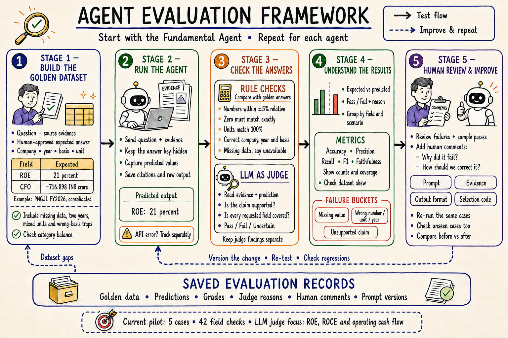

# Agent evaluation framework

Start with the Fundamental Agent, then repeat the process for each agent using
its own expected outputs and evaluation rules.

1. **Build the golden dataset.** Pair each question and its source evidence with a
   reviewed expected answer. Specify company, period, basis and units. Include
   normal examples, missing evidence, multiple years and confusing alternatives.
   Count examples by category so the dataset's balance is visible.
2. **Run the agent.** Give it the question and evidence. Keep the answer key hidden.
   Save predictions, citations and raw responses. Track API errors separately.
3. **Check the answers.** Compare values and identities with the answer key using
   rules. Separately ask the LLM judge whether the final claims are supported by
   the supplied evidence and whether each requested field was answered.
4. **Understand the results.** Show expected versus predicted values, pass/fail
   reasons and failure categories. Show counts alongside accuracy, precision,
   recall, F1, faithfulness and coverage. Compare fields and scenarios so a large
   easy category cannot hide a small weak category.
5. **Review and improve.** Humans review failures and sampled passes, including
   judge disagreements. Record why each failed and how to correct it. Change the
   prompt, evidence, output format or selection code as the evidence warrants.
   Version the change and compare before/after on the same cases, then test unseen
   cases. Dataset gaps feed back into the golden dataset.

The Fundamental Agent's numeric tolerance is ±5% relative to the expected value;
zero must match exactly. Units, company, period and accounting basis must match.
When evidence is absent, an explicit unavailable answer is different from silently
omitting the field.

This poster represents the workflow, including the planned review and improvement
loop. The current pilot has five cases and 42 field checks. The completed LLM judge
review covers only the 18 ROE, ROCE and operating-cash-flow checks. It uses the same
configured model as the actor in separate calls. The proposed revised extraction
prompt has not yet been deployed or benchmarked.

See the [judge findings](../evals/fundamentals/llm_judge_report.md) and
[category analysis](../evals/fundamentals/result_analysis.md).

Illustration created using the built-in ImageGen tool. The
[generation prompt](assets/evaluation-framework-image-prompt.txt) and
[correction prompt](assets/evaluation-framework-image-edit-prompt.txt) record how
it was made. The supplied investment architecture image was used as a style
reference.
